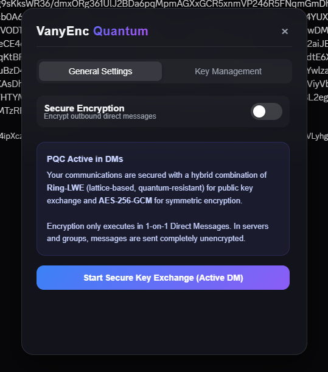
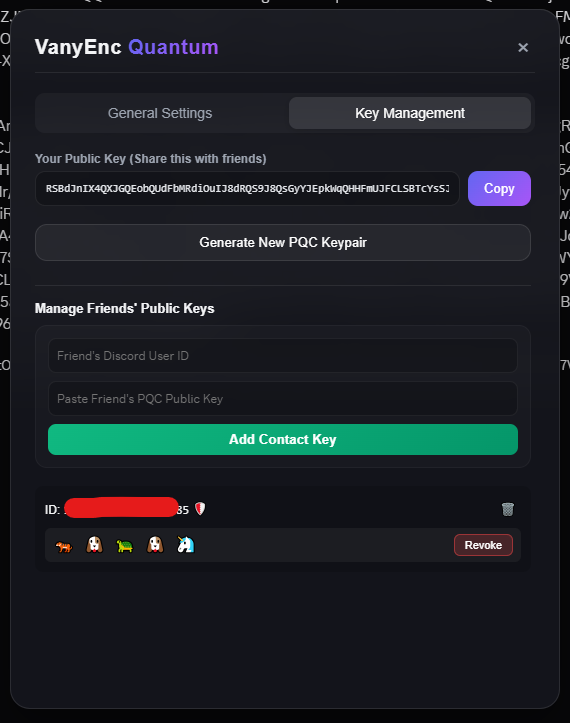

# VanyEnc

VanyEnc is a post-quantum cryptography integration for Discord DMs. It uses Ring-LWE key exchange and AES-256-GCM symmetric encryption to secure your direct messages. The project is split into a Chrome/Chromium browser extension and a Python loader that injects the script directly into the desktop Discord client via remote debugging.

<div id="header" align="center">
  
  
</div>


## How to Set Up the Files

The core JavaScript logic is contained in vany.js. To make sure everything works correctly, you need to copy or paste your original vany.js file into the following locations:

1. In the root directory of the project: vany.js
2. Inside the browser extension folder: vanyenc_extension/vany.js
3. Inside the python loader folder: vanyenc_loader/vany.js

Having the file in these locations allows both the extension and the Python loader to read and load the script.

## Installing the Browser Extension

If you use Discord in a web browser like Chrome, Brave, or Edge, you can install the extension to run the script.

1. Open your browser and navigate to the extensions management page. In Google Chrome, go to `chrome://extensions/`. In Microsoft Edge, go to `edge://extensions/`.
2. Enable the Developer mode toggle, which is usually located in the top-right corner of the page.
3. Click the Load unpacked button in the top-left corner.
4. In the file explorer window that opens, select the `vanyenc_extension` folder from this project directory.
5. Once selected, the extension will be loaded. It will automatically inject vany.js when you visit Discord.

## Running the Python Loader

If you use the Discord desktop app on Windows, you can use the Python loader to run the script. The loader automatically finds your Discord installation, kills any existing Discord processes, launches it with remote debugging enabled on port 9222, and injects vany.js.

### Installing Dependencies

Before running the loader, you need to install the required Python libraries. Open your command prompt or terminal and run the following command:

```bash
pip install psutil websocket-client
```

These libraries are necessary for the script to manage Discord processes and communicate with the DevTools debugging port.

### Launching the Loader

Once the dependencies are installed and you have placed vany.js inside the `vanyenc_loader` folder, run the following command from the root of the project:

```bash
cd vanyenc_loader
python loader.py
```

The loader will do the following:
1. Locate your latest Discord app installation on Windows.
2. Close any running Discord instances to free up port bindings.
3. Launch Discord with debugging flags enabled.
4. Wait for the remote debugging interface to become active.
5. Inject the vany.js script directly into the Discord client.
